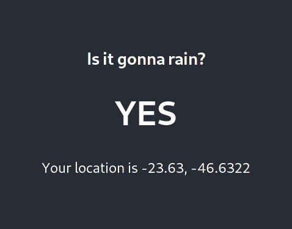

# Tenki (天気) Channel :cloud:

Tenki Channel is a tech demo that puts [Kogito](https://kogito.kie.org/), [Camel](https://kogito.kie.org/), [Quarkus](https://kogito.kie.org/) and OpenShift together to showcase some examples using those components.

Tenki (天気) in Japanese means _weather_. :-D

## Rain Forecast - Is it gonna rain? :umbrella:

In this use case we have two services working together to answer a simple question: "Is it gonna rain on my location?".

The first service, [**Rain Forecast Process**](rain-forecast-process) uses the process automation framework, Kogito, to automate a forecast process that will call the [**Weather API Gateway**](weather-api-gateway). Based on the weather forecast results, calculated by a decision rule, the process will give you the answer.

The Weather API Gateway is a Camel service that hides the external weather service and exposes the domain data that we're interested in. The gateway implements (in a certain level) the [API Gateway pattern](https://microservices.io/patterns/apigateway.html).

Both services are backed by the Quarkus framework. This means that you can run in native code in the cloud.

To make all this work, read the guides ([here](rain-forecast-process) and [here](weather-api-gateway)) and have both services up and running. You should call the Rain Forecast Process at the `rainforecast` endpoint to see it in action.

### Deploying on OpenShift ⭕️

It's pretty easy to deploy the Rain Forecast demo on your OpenShift cluster:

```bash
# clone this repo
git clone https://github.com/ricardozanini/tenkichannel.git
$ cd tenkichannel
$ oc create new-project tenkichannel
$ oc create -f openshift/rain-forecast/rain-forecast-backend.yaml
# grab your API key on https://openweathermap.org/api
$ oc new-app --template=rain-forecast-demo -p NAMESPACE=tenkichannel -p OPENWEATHER_API_KEY=<your-api-key>
```

Then, use the route to access the process:

```bash
$ oc get route

NAME            HOST/PORT                                                           PATH   SERVICES        PORT       TERMINATION   WILDCARD
rain-forecast   rain-forecast-tenkichannel.apps.your-cluster.com                           rain-forecast   8080-tcp    edge         None
```

See how to use it at the [Rain Forecast README doc](rain-forecast-process/README.md).

#### Deploying the User Interface

After having the backend working and playing with the API, it's time to have some fun with the UI. To deploy it, you'll need the Rain Forecast Process route url to make this work. Given that you've already deployed the `rain-forecast` application like stated above, just do:

```bash
# create the UI template
$ oc create -f openshift/rain-forecast/rain-forecast-ui.yaml
# create the UI application using as parameter the rain-forecast route that were generated in the above section
$ oc new-app --template=rain-forecast-demo-ui -p BACKEND_ROUTE=https://rain-forecast-tenkichannel.apps.your-cluster.com
```

You should see the build spinning and in a couple minutes your application will be ready for use.

If you're running on a development environment, chances are that you're using self signed certificates. If this is the case, try to access the backend route at least once to have your browser to trust in your certificate.

Access the application using the new route, allow the browser to read your location and have fun!



## TODO

* [x] OpenShift templates to deploy the services into the cloud
* [ ] Deploy the Kogito service via Kogito CLI
